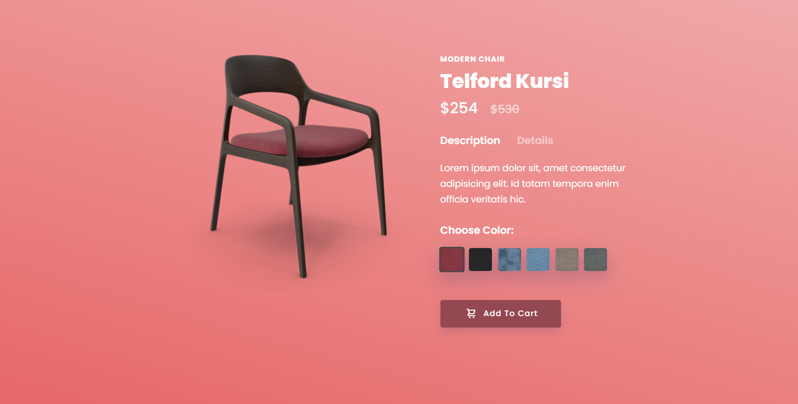

# Chair Project - HTML & CSS Showcase

Welcome to the Chair Project! This project is a showcase of different chair designs created using HTML and CSS.

## Table of Contents
- [Introduction](#introduction)
- [Designs](#designs)
- [Installation](#installation)
- [Usage](#usage)

## Introduction
The Chair Project demonstrates the creation of various chair designs using HTML and CSS. Each chair design is a standalone piece of code that showcases different techniques and styles in web design.

## Designs
This project includes a variety of chair designs, each with its own unique styling and characteristics. The designs feature different color schemes, shapes, and materials, providing a visual exploration of creative possibilities.

## Installation
To view this project locally, follow these steps:

1. Clone this repository to your local machine.
2. Open the project directory: `cd chair-project`
3. Open any chair design HTML file in your preferred web browser.

## Usage
1. Open any chair design HTML file (e.g., `chair.html`) in your web browser.
2. Explore the design details, including color choices, layout, and styling.
3. Each chair design is self-contained in its respective HTML and CSS files.

